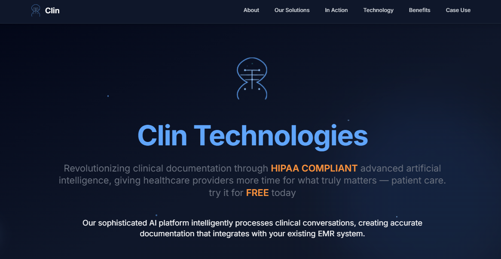

# 🏥 Clin Technologies

**Revolutionizing clinical documentation through HIPAA-COMPLIANT AI.**  Clin Technologies empowers healthcare providers with intelligent, secure, and customizable AI solutions that dramatically reduce documentation time and improve accuracy.

---

## 🚀 Overview

Clin Technologies is a cutting-edge platform designed to streamline clinical documentation and compliance using advanced **Natural Language Processing (NLP)** and **Machine Learning (ML)** technologies. Our AI-based tools integrate seamlessly with Electronic Medical Records (EMR) systems and are tailored to fit diverse clinical workflows across specialties.

> "Giving healthcare providers more time for what truly matters — patient care."

---


## 🔗 Preview

 
--
🌍 Live Demo - https://clin-tech.vercel.app/

---

## 🧠 Core Products

### ✅ Validify
Optimize chart reviews with AI that ensures coding accuracy, regulatory compliance, and identifies documentation gaps.

### 🔒 Redactify
Automatically redact HIPAA identifiers in text, documents, and structured data — maintaining compliance without compromising clinical value.

### ✍️ TranscriptX
AI-powered medical transcription tool that captures patient-provider conversations with exceptional accuracy and clinical understanding.

### 📊 Chartwright
Turn natural language notes into customized, high-quality charts that align with your clinic’s documentation standards.

---

## 💡 Why Clin Technologies?

- 📉 **Reduce documentation time by 40–60%**
- 🧘 **Improve provider work-life balance**
- 🩺 **Enhance patient interaction**
- 🧾 **Improve accuracy & reduce compliance risk**
- 🔐 **HIPAA-COMPLIANT + BAA available**
- 🔁 **Adaptive learning from your data and workflows**

---
## 🛠 Tech Stack

**Frontend:**
- React 19 – Modern UI development
- React Router v7 – Client-side routing
- Redux Toolkit – Scalable state management
- Axios – API handling and HTTP requests

**Tooling & Dev Experience:**
- Vite – Lightning-fast build tool
- ESLint – Code linting for consistency and quality
- TypeScript (via @types) – Static typing for React

**Styling:**
- Tailwind CSS – Utility-first CSS framework
- PostCSS & Autoprefixer – CSS transformation and browser compatibility


---


## <a name="getting-started">🚀 Getting Started</a>

To get started follow these steps:

#### Cloning the Repository

Using CLI

```bash
git clone https://github.com/smRid/Clin-Tech.git
```

**\*\*_Ensure you have installed [Git](https://git-scm.com) on your machine._**

or using GitHub:

-   Go to the project [repository](https://github.com/smRid/Clin-Tech) on my GitHub page
-   Click on the green button on the top 👆
-   Click Download ZIP

#### Installation

Install the project dependencies using npm:

```bash
npm install
```

**\*\*_Ensure you have installed [NodeJS](https://nodejs.org/en) on your machine._**

#### Running the Project

```bash
npm run dev
```


**\*\*_Navigate to http://localhost:5173/ in your browser to access the local development server._**

---

